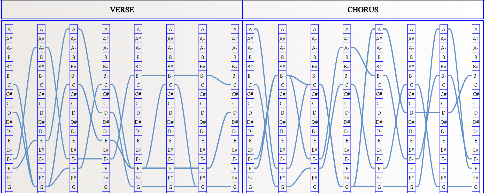
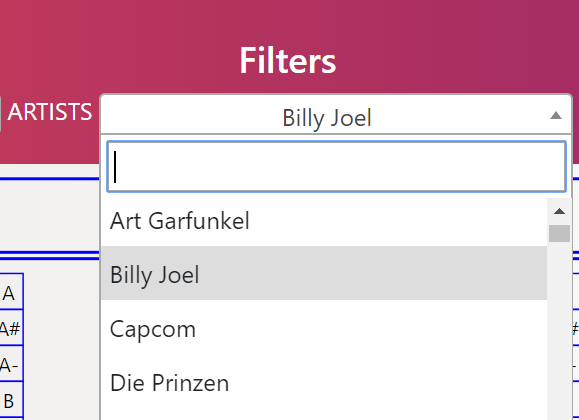
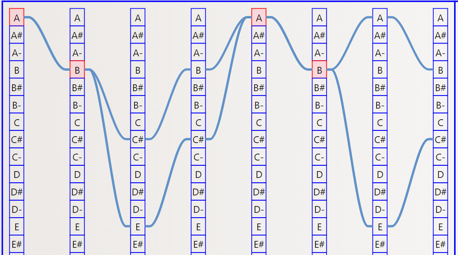

## The points of improvement:

the last version presented of our application is the one visualized in the figure below:
<table border="0">
  <tr>
    <td>
      
    </td>
  </tr>
  <tr>
    <td align="center">
      <h6> The first visualization </h6>
    </td>
  </tr>
</table>
Your comments and suggestions were really very importants for us to arrive at the final version of our application that answers wisely to the requirements of the specifications and it will help students learn to play on the instruments they want.

1/- When selecting multiple songs, add a color to the most used chords:
 In order to improve the quality of our visualization we used a high density color as well as increased the splicer curves that represent the sequence of chords.
 <table border="0">
  <tr>
    <td>
      
    </td>
  </tr>
  <tr>
    <td align="center">
      <h6> Improved visualization quality </h6>
    </td>
  </tr>
</table>

2/- Sort the artists in alphabetical order:

As part of the improvement, our application allows the search of artists using a drop-down list as well as it puts the names of the artists in alphabetical order.
 <table border="0">
  <tr>
    <td>
      
    </td>
  </tr>
  <tr>
    <td align="center">
      <h6> the artists in alphabetical order </h6>
    </td>
  </tr>
</table>

3/- Ability to click on n agreement and get all the songs that use this chord:
By clicking on a series of chords, the application displays all the chonsans that contain the chosen chords
 <table border="0">
  <tr>
    <td>
      
    </td>
  </tr>
  <tr>
    <td align="center">
      <h6> Improved visualization quality </h6>
    </td>
  </tr>
</table>
