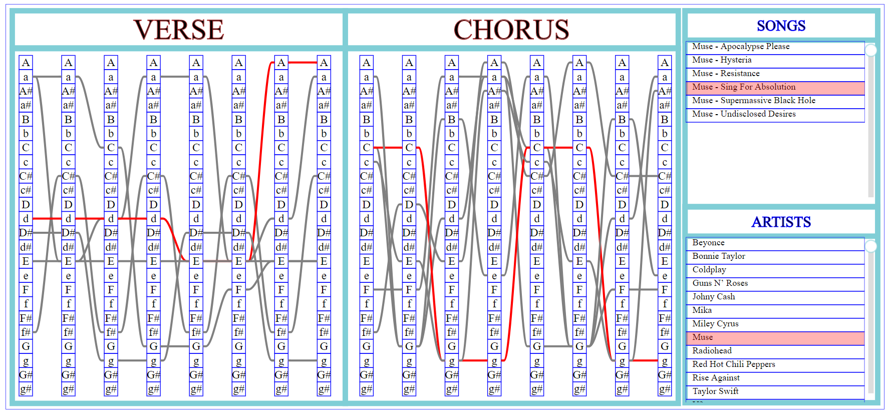

## The points of improvement:

the last version presented of our application is the one visualized in the figure below:
<table border="0">
  <tr>
    <td>
      
    </td>
  </tr>
  <tr>
    <td align="center">
      <h6> The first visualization </h6>
    </td>
  </tr>
</table>
Your comments and suggestions were really very importants for us to arrive at the final version of our application that answers wisely to the requirements of the specifications and it will help students learn to play on the instruments they want.
1/- Lors de la sélection de plusieurs chansons, ajouter une couleur sur les accords les plus utilisés:

2/- Classer les artistes par ordre alphabétique?

3/- Tooltip avec la tablature de l’accord sélectionné ? (utile pour un guitariste débutant)

4/- Possibilité de cliquer sur une ligne et remonter à l’artiste/chanson

5/- Possibilité de cliquer sur n accord et obtenir toutes les chansons qui utilisent cet accord

