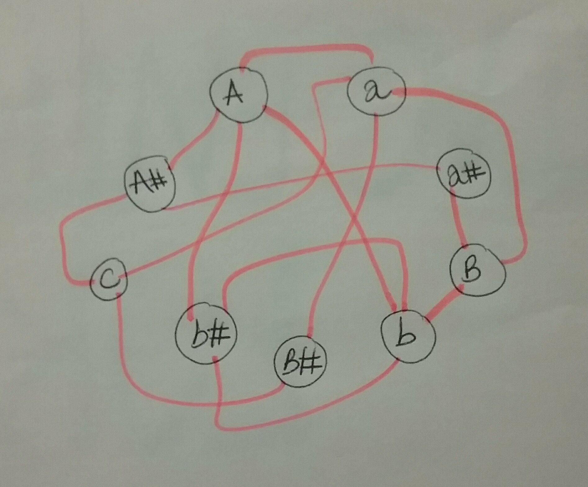
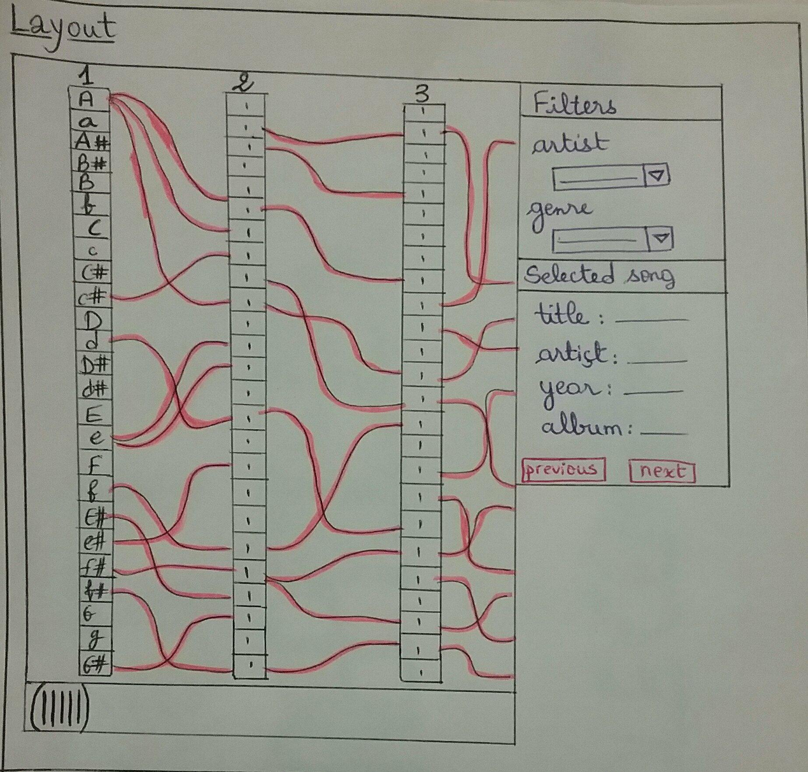
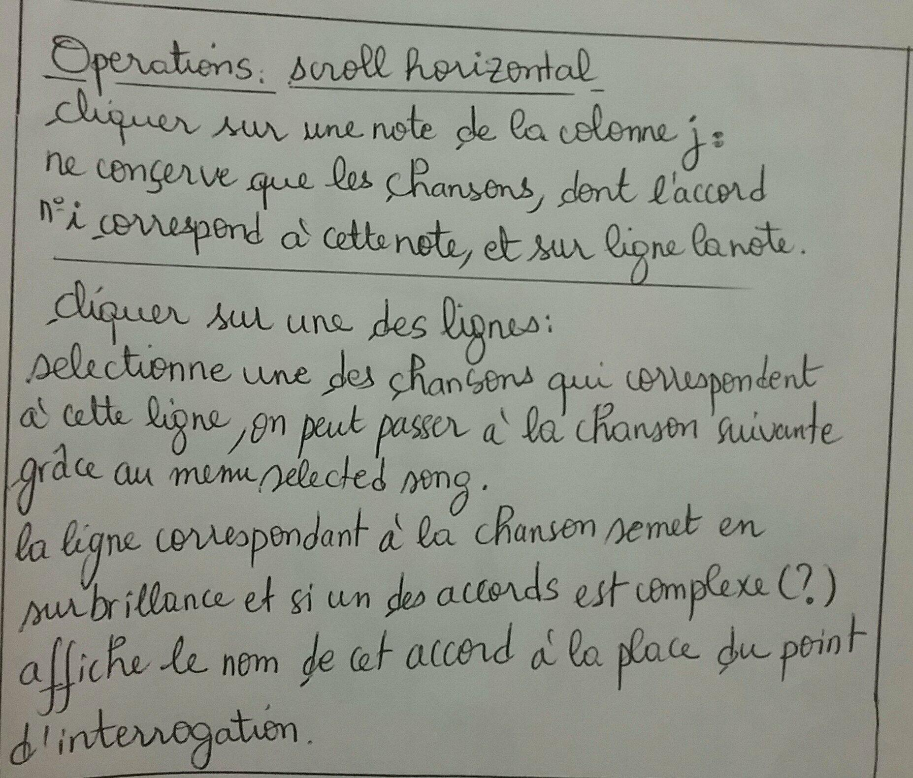
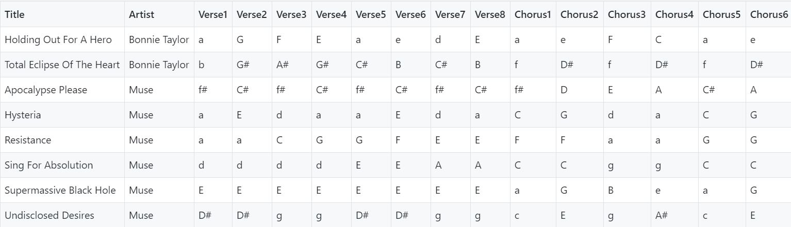
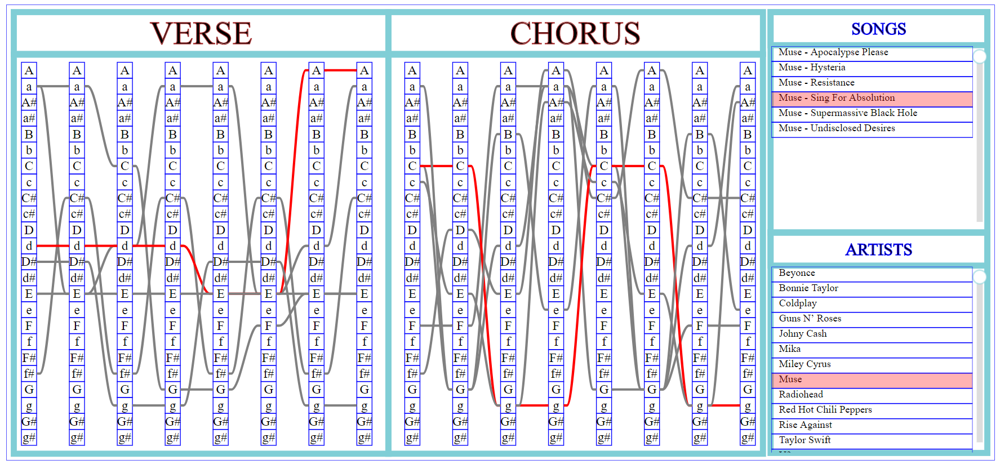

# ChordViz:
### Project made by:
__DIERS Antoine__

__EL IDRISSI Imane__

__Jebbari Marwane__
 
## Table of contents :

      . Introduction

      . the features of the application

      . Description of our new Data Base
      
      . Organization of elements
      
      . Possible interactions and interactions management
      
      . Improvements
      
      . Link to video

      . Conclusion
      
      . Resources
      
## Dataviz course project : visualization of chord progressions in music
As part of the MOS projects: Interactive visualization of data, we chose the project entitled: __Visualization of the sequence of chords of a number of songs:__

* selection by artist, song ...
* Ability to find a song by selecting a harmonic progression.

At first, we were thinking about relying on graph theory to visualize the sequence of chords of a certain number of songs in the database we choose. But this presents a problem of the order of the chords and a collision between them as shown in the figure below, then the person will not manage to play the good song as well as we will have an overlap in the ranges of selected chonsons.
<table border="0">
  <tr>
    <td>
      
    </td>
  </tr>
  <tr>
    <td align="center">
      <h6> Chain graph of chords </h6>
    </td>
  </tr>
</table>

So, given the problems encountered by the first solution, we managed to propose a relevant model that meets the requirements of the specifications of our application.

<table border="0">
  <tr>
    <td>
      
    </td>
  </tr>
  <tr>
    <td align="center">
      <h6> visualization of a sequence of chords using rectangles </h6>
    </td>
  </tr>
</table>

<table border="0">
  <tr>
    <td>
      
    </td>
  </tr>
  <tr>
    <td align="center">
      <h6> Proposed operations </h6>
    </td>
  </tr>
</table>
At first, we worked on the following database:
<table border="0">
  <tr>
    <td>
      
    </td>
  </tr>
  <tr>
    <td align="center">
      <h6> The database of songs </h6>
    </td>
  </tr>
</table>

## the features of the application:

Our D3.js script consists of the following features:

- Determine a duration of transitions for the appearance / dispartition of lines.

- Determine the number of songs in the database.

- Determine the smallest opacity that can have a line and the width of the lines.

- Send the string corresponding to the chord no. Bar of the song n ° song.

- Maximum number of measures (if it is larger than the number of measures of the biggest song, it's a mess because it will put empty measures at the end, if it is smaller the last chords will not be displayed ).

- Determine the width of one of the rectangles containing a chord name, the horizontal distances, the vertical between two rectangles containing a chord and the Width and height of the svg.

- Determine a list that contains the integers from 1 to MAX_BAR_ID, and another list containing the most common chord names, "?" corresponds to the other agreements.

- Determine the dimensions of the display area on the svg, the height of one of the rectangles containing a chord, and the size of the font.

- The management of scrolling.

- Determine groups of elements, bars [i] contains the rectangles containing the chord names of measure i. As well as the elements on which we can not click.

- Definition of an object d3 allowing to generate the curves.

- The creation of groups of elements in which we will store the curves of each song.

- Browse the songs and create for each song all of its curves.

- Implementation of a function that manages the update of the curves when one selects / deselects a chord.
<table border="0">
  <tr>
    <td>
      
    </td>
  </tr>
  <tr>
    <td align="center">
      <h6> the result of our script D3.js </h6>
    </td>
  </tr>
</table>

## Description of our new Data Base:

We used a csv database containing the following columns : 

* __Title :__ The song's title
* __Artist :__ The name of the interpreter
* __Genre :__ The musical genre of the song
* __Verse1 :__ The first chord of the verse (ex : G-)
* __...__
* __Verse8 :__ The eighth (last) chord of the verse
* __Chorus1 :__ The first chord of the chorus
* __...__
* __Chorus8 :__ The eighth (last) chord of the chorus

We created this database ourselves from the site [hooktheory](https://www.hooktheory.com/theorytab) 

## Organization of elements:

The page contains several groups of items:

* __unclickable_elements :__ This group contains items that can not be clicked (useful for clicking on an item that is in background)
* __a group for each measure :__ 
* __un groupe de courbes pour chaque chanson :__ these groups contain the clickable squares of each measure.
* __songs_group :__ This group contains the rectangles and texts representing the titles of the songs in the "songs" window at the top right.
* __artists_group :__ This group contains rectangles and texts representing the names of the performers in the "artists" window at the bottom right.

## Possible interactions and interactions management:

### It is possible to : 

* Click on a chord in a bar to keep only the songs that have this chord on that chord.
* Click on the title of a song to highlight it on the diagram.
* Click on an artist to keep only the songs of this artist.

 These interactions are possible thanks to three global variables: __selected_song__, __selected_artist__ and __selected_chords__. 

### The interactions work as follows :

* __User action :__ for example click on an artist 
* __Update global variables :__ for example, if the user clicked on an artist, __selected_artist__ is updated.
* __Update valid songs :__  We browse the songs and for each song, we decide according to the three global variables mentioned above if it is valid.
* __Update the display:__ Show the curves of the valid songs and their titles in the "Songs" window.

### Functions used : 

* __update_valid_songs :__ This function takes into considiration the three global variables  __selected_song__, __selected_artist__ and __selected_chords__ .
In order to decide which songs are valid, it updates the global variable __valid_songs__ which is an array of size n (the number of songs). Which contains 1 in position i if the song i is valid.

* __display_valid_songs :__ This function uses the __valid_songs__ array to show only songs that are valid in the "songs" window (top right).

* __update_curves :__ This function uses the __valid_songs__ array to display only the curves of songs that are valid.
 
 ## Improvements:
<table border="0">
  <tr>
    <td>
      
    </td>
  </tr>
  <tr>
    <td align="center">
      <h6> The first visualization </h6>
    </td>
  </tr>
</table>
Your comments and suggestions were really important for us to arrive at the final version of our application that responds wisely to the requirements of the specifications and it will help students learn to play on the instruments they want.
Please find in the following file: [UpData.md](https://www.github.com/jmarwane/ChordViz/blob/master/design/UpDate.md) details on improvement points made.

## Link to video:

[Here it is !! Thanks you for watching and feel free to ask us](https://www.youtube.com)

  

<a href="https://www.youtube.com">
<figure>
  
 
</figure>
</a>

 <i>Youtube </i> 

    

## Conclusion:
  
## Resources:
 .  https://syntagmatic.github.io/parallel-coordinates/

